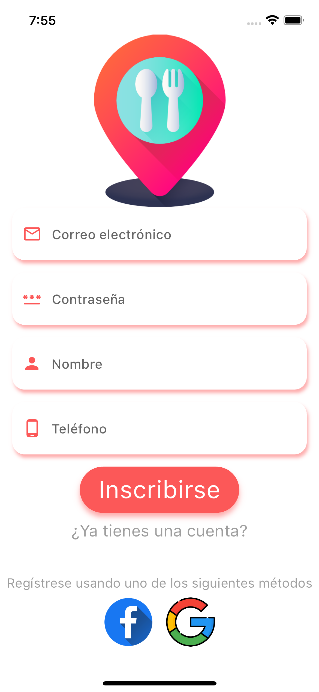

# Fast food shop app
Android, iOS
 

### Framework used:
* [ Getx ](https://pub.dev/packages/get)
* [ GoogleMaps ](https://pub.dev/packages/google_maps_flutter)
* [ Laravel echo  ](https://github.com/kakajansh/echo.git)

### FoodShop backend project:
* [ API-REST-LARAVEL-FOOD  ](https://github.com/Yader1/api-rest-laravel-food)

 |  |  
-----------------------------------|------------------------------------|-----------------------------------

 |  |  
-----------------------------------|------------------------------------|-----------------------------------

 |  |  
-----------------------------------|------------------------------------|-----------------------------------

 | 
-----------------------------------|------------------------------------
